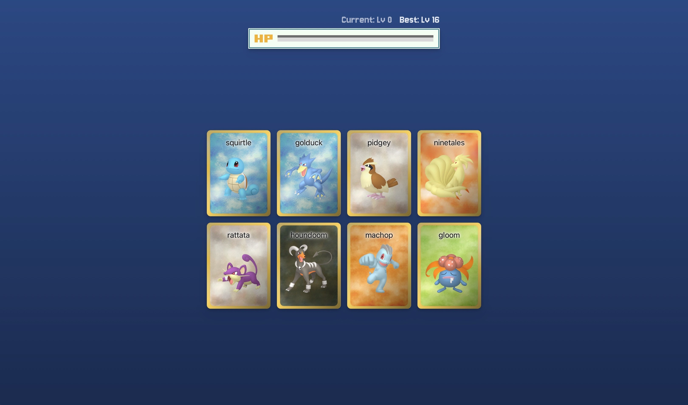
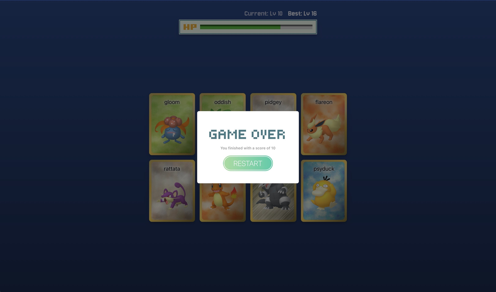

# Memory-card

Memory card game.

## [Demo](https://memory-card-d5x.pages.dev/)

## Features

- Flip cards and memorize checked cards from their unchecked counterparts
- Keep track of scores and highscores with a health bar stylized scoreboard.

## Tech Stack

- **UI Library**: React
- **Languages**: JavaScript, HTML, CSS
- **Build Tool**: Vite
- **Deployment**: Vite
- **Dependencies**:

## Main Directories

Located in `components/`

- `Page/`: The main page holding everything together
- `Card/`: Individual card components
- `Gameboard/`: Game board component to hold a deck of cards
- `Healthbar/`: Scoreboard in style of a health bar and levels
- `Popup/`: Full-screen popup
- `Button/`: Button component

Located in `utils/`

- `arrayUtils.js`: utility array functions
- `PokeAPI_api.js`: fetch functions
- `pokemons.js`: pokemon data

## Acknowledgements

API service used: https://pokeapi.co
